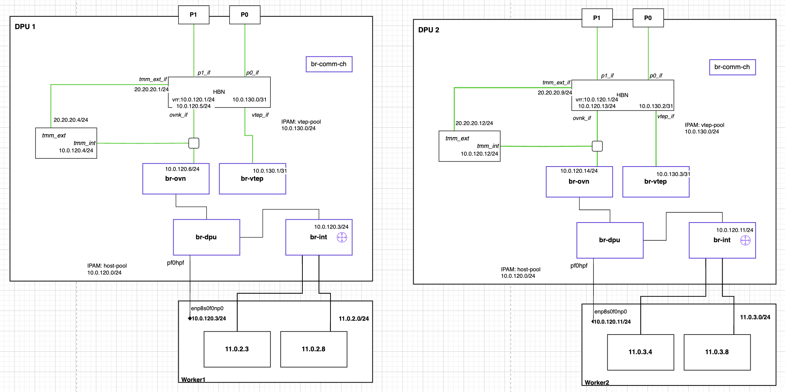

# Disable gateway SNAT and separate VTEP IPAM

## Overview

OVN gateway routers can preserve pod source IPs so an external service, such
as F5 TMM, can apply SNAT for pod egress. Split IPAM gives VTEP transport and
the host-facing network separate address pools, bridge addresses, and gateways.
The two features can be configured independently.

The host pool supplies addresses for the host PF, OVN gateway, `br-ovn`, and
HBN's internal network. The VTEP pool supplies a separate point-to-point link
between HBN and `br-vtep` on each DPU. This keeps Geneve transport separate
from the network used to reach the external SNAT service.

## Disable gateway SNAT

Set these OVN Helm values on the DPU service:

```yaml
extendedFeatures:
  disableGatewayRouterSNAT: true
global:
  enableEgressIP: false
```

The chart sets both `OVN_DISABLE_SNAT_GATEWAY_ROUTERS` and
`OVN_DISABLE_SNAT_MULTIPLE_GWS` to `true`. Pod egress then reaches the
external SNAT service with its original source IP.

Keep `enableEgressIP` disabled for this configuration. The SNAT override is
needed on the OVN DPU service; it is not required on the host installation.
Use a chart and images that support these settings.

## Separate VTEP and host IPAM

### Example topology



Worker1 and worker2 each have a paired DPU. The example uses these pools:

| Pool | Type | Network | Allocation |
| --- | --- | --- | --- |
| `host-pool` | `ippool` | `10.0.120.0/24` | Eight addresses per node; shared gateway `10.0.120.1` |
| `vtep-pool` | `cidrpool` | `10.0.130.0/24` | One `/31` per DPU; gateway index `0` |

Create the pools and connect the interfaces through your deployment system.
Choose networks that do not overlap the pod, service, or management networks.
The diagram's external test addresses are placeholders: use `TMM_EXT_CIDR`
for your external subnet, `TMM_EXT_IP` for the TMM interface/SNAT address,
and `TMM_EXT_GATEWAY_IP` for its HBN next hop.

### OVN Helm values

Configure the pools and separate indexes for the host PF and `br-ovn`:

```yaml
dpuManifests:
  enabled: true
  hostCIDR: $TARGETCLUSTER_NODE_CIDR
  ipam:
    vtep:
      cidr: 10.0.130.0/24
      pool: vtep-pool
      poolType: cidrpool
      ipIndex: 1
    hostInterface:
      cidr: 10.0.120.0/24
      pool: host-pool
      poolType: ippool
      ipIndex: 2
      brOVNIPIndex: 5
```

Replace `$TARGETCLUSTER_NODE_CIDR` with the host cluster's node network CIDR.
It is separate from the host-interface pool and the pod network. Set the usual
API endpoint, pod/service CIDRs, and host-cluster credentials for your setup.

`vtep.ipIndex` selects the VTEP address. `hostInterface.ipIndex` selects the
host PF address; `hostInterface.pfIPIndex`, when set, overrides that index.
`brOVNIPIndex` requests a separate address for `br-ovn`. With that allocation,
the provisioner puts the VTEP address on `br-vtep` and the host-facing address
on `br-ovn`. OVN's router subnet and next hop use the host-facing allocation.

The new pool settings take precedence over the default IPAM `ipamPool`,
`ipamPoolType`, `ipamVTEPIPIndex`, `ipamPFIPIndex`, and `vtepCIDR` values.
Without a separate `br-ovn` allocation, the provisioner retains the default
single-bridge path.

### Interface addresses

For the example allocation order:

| Endpoint | Allocation | DPU1 / worker1 | DPU2 / worker2 |
| --- | --- | --- | --- |
| Shared HBN gateway | Host pool gateway / HBN VRR | `10.0.120.1/24` | `10.0.120.1/24` |
| Host PF and OVN gateway router | Host index `2` | `10.0.120.3/24` | `10.0.120.11/24` |
| Example TMM `tmm_int` | Host index `3` | `10.0.120.4/24` | `10.0.120.12/24` |
| HBN internal SVI, attached through `ovnk_if` | Host index `4` | `10.0.120.5/24` | `10.0.120.13/24` |
| OVN `br-ovn` | Host index `5` | `10.0.120.6/24` | `10.0.120.14/24` |
| HBN `vtep_if` | VTEP gateway index `0` | `10.0.130.0/31` | `10.0.130.2/31` |
| OVN `br-vtep` | VTEP index `1` | `10.0.130.1/31` | `10.0.130.3/31` |

Host indexes are zero based within each node's allocation, starting at `.1`
and `.9` in this example. Eight addresses per node is an allocation group;
all host-facing interfaces use the shared `/24` prefix. Check the actual
allocations before configuring next hops. The `br-int` labels show logical
OVN gateway router addresses. The provisioner supplies the host PF address
from the host pool.

### Bridge and network requirements

Keep the host representor `pf0hpf` on `br-dpu` and the patch connection between
`br-dpu` and `br-ovn`. Create `br-vtep` before the provisioner starts:

```bash
ovs-vsctl --may-exist add-br br-vtep
ovs-vsctl set bridge br-vtep datapath_type=netdev
```

Connect `br-ovn` to HBN's internal network through `ovnk_if`, and connect
`br-vtep` to HBN `vtep_if`. HBN must use the opposite endpoint of each VTEP
`/31` and provide fabric reachability for the VTEP pool, including return routes.
In the example, HBN's internal SVI uses host index `4` and the shared VRR
gateway `10.0.120.1/24`.

For the illustrative TMM path, `tmm_int` joins the internal network and
`tmm_ext` connects to HBN `tmm_ext_if` on `TMM_EXT_CIDR`. Configure the SNAT
service and its routing separately.

## Routing and verification

Keep the VTEP transport route separate from the internal network's egress route.
HBN's shared gateway provides the OVN next hop and routes pod egress toward
TMM's internal address. TMM applies SNAT using `TMM_EXT_IP` and forwards
through its external interface. Provide return routing to the pod networks.

```text
pod → OVN gateway router (pod source preserved) → br-dpu → br-ovn
    → HBN → tmm_int → TMM SNAT → tmm_ext → external network
```

Check that:

- The host PF and `br-ovn` have distinct addresses from the host pool.
- `br-vtep` uses the VTEP pool and Geneve connectivity works between DPUs.
- Pod egress reaches `tmm_int` with its original source IP, leaves `tmm_ext`
  with the chosen SNAT address, and receives replies.
