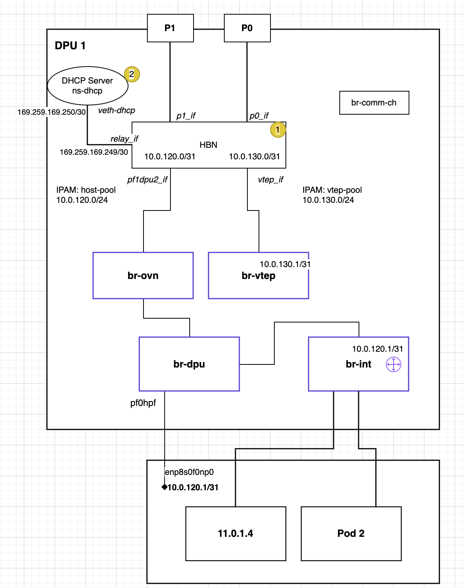

## Disable SNAT in OVN-Kubernetes

### Chart Configuration

Use the following OVN-Kubernetes chart and version:

- Repository: `oci://ghcr.io/mellanox/charts`
- Chart: `ovn-kubernetes-chart`
- Version: `v0.0.1-split-ipam`

Example configuration:

```yaml
repoURL: "oci://ghcr.io/mellanox/charts"
chart: "ovn-kubernetes-chart"
version: "v0.0.1-split-ipam"
```

### Enable SNAT Disable Feature

To disable SNAT on gateway routers, enable the `disableSnatGatewayRouters` flag in the Helm values:

```yaml
values:
  global:
    disableSnatGatewayRouters: true
    # enableEgressIP: true
```

> **Note:**
>
> - `enableEgressIP` must remain disabled when using `disableSnatGatewayRouters`; enabling it will cause OVN to drop packets.
> - `disableSnatGatewayRouters` need to be only set on the OVN DPUService on the DPU Cluster, it is not neccessary to be set on the Host Cluster.

### Complete Example

Below is a full example of a `DPUServiceTemplate` with the required configuration:

```yaml
apiVersion: svc.dpu.nvidia.com/v1alpha1
kind: DPUServiceTemplate
spec:
  deploymentServiceName: "ovn"
  helmChart:
    source:
      repoURL: $OVN_KUBERNETES_REPO_URL
      chart: ovn-kubernetes-chart
      version: $OVN_KUBERNETES_CHART_TAG
    values:
      global:
        disableSnatGatewayRouters: true
        # enableEgressIP: true
        # Note: other feature flags are skipped here deliberately
```

## Split IPAM ( Separate IPAM for VTEP and Host Interfaces)

### Topology



#### Pool A: HBN <-> OVN-k host gateway + Host PF

DPUServiceIPAM "host-pool"  
network: 10.0.120.0/24  
prefixSize: 31

#### Pool B: HBN <-> OVN VTEP (br-vtep)

DPUServiceIPAM "vtep-pool"  
network: 10.0.130.0/24  
prefixSize: 31

DPU1 gets:

host /31: 10.0.120.0/31  
.0 = HBN pf2dpu2_if  
.1 = OVN host gateway endpoint (br-ovn / OVN GR-side) and Host PF

vtep /31: 10.0.130.0/31  
.0 = HBN vtep_if  
.1 = OVN VTEP (br-vtep)

DPU2 gets:

host /31: 10.0.120.2/31  
.2 = HBN pf2dpu2_if  
.3 = OVN host gateway endpoint (br-ovn / OVN GR-side) and Host PF

vtep /31: 10.0.130.2/31  
.2 = HBN vtep_if  
.3 = OVN VTEP (br-vtep)

and so on...

> **Note:** A DHCP server is required to assign IP addresses to Host Interfaces on the PF. Options for providing this are documented in [dhcp.md](dhcp.md). These are shown as options in the topology diagram. Alternatively assign the IP manually on the host interfaces so that OVN-Kubernetes on the host can come up fully.

### DPU Service configuration values for split ipam model

```yaml
apiVersion: svc.dpu.nvidia.com/v1alpha1
kind: DPUServiceConfiguration
spec:
  deploymentServiceName: "ovn"
  serviceConfiguration:
    helmChart:
      values:
        dpuManifests:
          hostCIDR: < user specified >
          ipam:
            vtep:
              cidr: 10.0.130.0/24
              pool: vtep-pool
              poolType: cidrpool
              ipIndex: 1
            hostInterface:
              cidr: 10.0.120.0/24
              pool: host-pool
              poolType: cidrpool
              ipIndex: 1
```

Note: Following resources need to be adapted to use the separate IPAM model. sample yamls for all resources below are available in the [yamls/](yamls/) folder.

### DPUFlavor

Add extra vtep bridge in dpu flavor

```yaml
# Create OVS bridge (br-vtep) to hold the VTEP IP
_ovs-vsctl --may-exist add-br br-vtep
_ovs-vsctl set bridge br-vtep datapath_type=netdev
```

### DPUServiceInterface

Need to create a new DPUServiceInterface of type `patch` to connect br-vtep to HBN container

```yaml
apiVersion: svc.dpu.nvidia.com/v1alpha1
kind: DPUServiceInterface
metadata:
  name: vtep
  namespace: dpf-operator-system
spec:
  template:
    spec:
      template:
        metadata:
          labels:
            port: vtep
        spec:
          interfaceType: patch
          patch:
            peerBridge: br-vtep
```

### DPUServiceIPAM

`host-pool` and `vtep-pool` DPUServiceIPAM need to be created as explained in the Topology section.

```yaml
---
apiVersion: svc.dpu.nvidia.com/v1alpha1
kind: DPUServiceIPAM
metadata:
  name: host-pool
  namespace: dpf-operator-system
spec:
  ipv4Network:
    network: "10.0.120.0/24"
    gatewayIndex: 0
    prefixSize: 31
---
apiVersion: svc.dpu.nvidia.com/v1alpha1
kind: DPUServiceIPAM
metadata:
  name: vtep-pool
  namespace: dpf-operator-system
spec:
  ipv4Network:
    network: "10.0.130.0/24"
    gatewayIndex: 0
    prefixSize: 31
```

### DPUDeployment

Add the extra vtep_if needed in the HBN container to the service chains section.

```yaml
apiVersion: svc.dpu.nvidia.com/v1alpha1
kind: DPUDeployment
spec:
  serviceChains:
    switches:
      - ports:
          - serviceInterface:
              matchLabels:
                port: vtep
          - service:
              name: hbn
              interface: vtep_if
```

### DPUServiceTemplate

#### HBN

```yaml
---
apiVersion: svc.dpu.nvidia.com/v1alpha1
kind: DPUServiceTemplate
spec:
  deploymentServiceName: "hbn"
  helmChart:
    values:
      image:
        repository: nvcr.io/nvidia/doca/doca_hbn
        tag: 3.2.1-doca3.2.1
      resources:
        memory: 4Gi
        nvidia.com/bf_sf: 4 # <-- extra sf here (from 3 to 4)
```

#### OVN

```yaml
---
apiVersion: svc.dpu.nvidia.com/v1alpha1
kind: DPUServiceTemplate
spec:
  deploymentServiceName: "ovn"
  helmChart:
    values:
      commonManifests:
        enabled: true
      dpuManifests:
        enabled: true
        image:
          pullPolicy: Always
        imagedpf:
          pullPolicy: Always
      global:
        # enableEgressIP: true
        disableSnatGatewayRouters: true
      leaseNamespace: "ovn-kubernetes"
      gatewayOpts: "--gateway-interface=br-dpu"
```

### DPUServiceConfiguration

#### OVN

```yaml
---
apiVersion: svc.dpu.nvidia.com/v1alpha1
kind: DPUServiceConfiguration
spec:
  deploymentServiceName: "ovn"
  serviceConfiguration:
    helmChart:
      values:
        dpuManifests:
          hostCIDR: $TARGETCLUSTER_NODE_CIDR # user needs to populate, see user guide
          ipam:
            vtep:
              cidr: 10.0.130.0/24
              pool: vtep-pool
              poolType: cidrpool
              ipIndex: 1
            hostInterface:
              cidr: 10.0.120.0/24
              pool: host-pool
              poolType: cidrpool
              ipIndex: 1
```

### HBN

Following extra configuration are needed
a) Extra ip request for vtep ip in the `k8s.v1.cni.cncf.io/networks` annotation
`{"name": "iprequest", "interface": "ip_vtep", "cni-args": {"poolNames": ["vtep-pool"], "poolType": "cidrpool", "allocateDefaultGateway": true}}`

b) `vtep_if` in the `spec.interfaces` section

##### Complete example

```yaml
---
apiVersion: svc.dpu.nvidia.com/v1alpha1
kind: DPUServiceConfiguration
metadata:
  name: hbn
  namespace: dpf-operator-system
spec:
  deploymentServiceName: "hbn"
  serviceConfiguration:
    serviceDaemonSet:
      annotations:
        k8s.v1.cni.cncf.io/networks: |-
          [
          {"name": "iprequest", "interface": "ip_lo", "cni-args": {"poolNames": ["loopback"], "poolType": "cidrpool"}},
          {"name": "iprequest", "interface": "ip_pf2dpu2", "cni-args": {"poolNames": ["pool1"], "poolType": "cidrpool", "allocateDefaultGateway": true}},
          {"name": "iprequest", "interface": "ip_vtep", "cni-args": {"poolNames": ["vtep-pool"], "poolType": "cidrpool", "allocateDefaultGateway": true}}
          ]
    helmChart:
      values:
        configuration:
          perDPUValuesYAML: |
            - hostnamePattern: "*"
              values:
                bgp_peer_group: hbn
            - hostnamePattern: "worker1*"
              values:
                bgp_autonomous_system: 65101
            - hostnamePattern: "worker2*"
              values:
                bgp_autonomous_system: 65201
          startupYAMLJ2: |
            - header:
                model: BLUEFIELD
                nvue-api-version: nvue_v1
                rev-id: 1.0
                version: HBN 2.4.0
            - set:
                interface:
                  lo:
                    ip:
                      address:
                        {{ ipaddresses.ip_lo.ip }}/32: {}
                    type: loopback
                  p0_if,p1_if:
                    type: swp
                    link:
                      mtu: 9000
                  pf2dpu2_if:
                    ip:
                      address:
                        {{ ipaddresses.ip_pf2dpu2.cidr }}: {}
                    type: swp
                    link:
                      mtu: 9000
                router:
                  bgp:
                    autonomous-system: {{ config.bgp_autonomous_system }}
                    enable: on
                    graceful-restart:
                      mode: full
                    router-id: {{ ipaddresses.ip_lo.ip }}
                vrf:
                  default:
                    router:
                      bgp:
                        address-family:
                          ipv4-unicast:
                            enable: on
                            redistribute:
                              connected:
                                enable: on
                          ipv6-unicast:
                            enable: on
                            redistribute:
                              connected:
                                enable: on
                        enable: on
                        neighbor:
                          p0_if:
                            peer-group: {{ config.bgp_peer_group }}
                            type: unnumbered
                          p1_if:
                            peer-group: {{ config.bgp_peer_group }}
                            type: unnumbered
                        path-selection:
                          multipath:
                            aspath-ignore: on
                        peer-group:
                          {{ config.bgp_peer_group }}:
                            remote-as: external

  interfaces:
    ## NOTE: Interfaces inside the HBN pod must have the `_if` suffix due to a naming convention in HBN.
    - name: p0_if
      network: mybrhbn
    - name: p1_if
      network: mybrhbn
    - name: pf2dpu2_if
      network: mybrhbn
    - name: vtep_if
      network: mybrhbn
```
